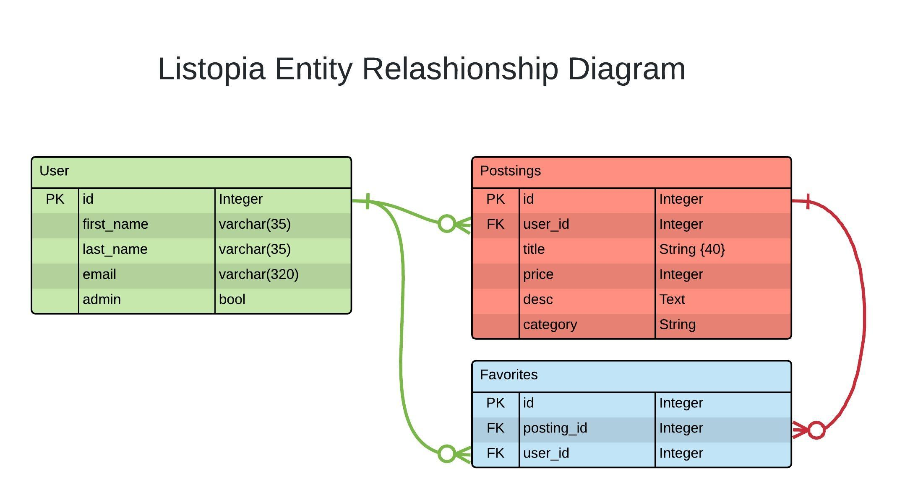

<h1 align="center">Welcome to listopia-RailsApi 👋</h1>
<p>
  
    <a href="https://github.com/nazeh/listopia-RailsApi#readme" target="_blank">
    
  </a>
  <a href="https://twitter.com/ArNazeh" target="_blank">
    
  </a>
</p>

> This is a RESTful API CRUD app built with Rails, as a server-side for Listopia React web app.



The goal is building a real-world-like project, built with business specifications. In which I had to build an MVP before a given deadline.

Find the code for the server-side API can, and the relevant documentation can at [**Listopia**](https://github.com/Nazeh/listopia)

### 🏠 [Homepage](https://github.com/Nazeh/listopia)

### ✨ [Demo](https://listopia.netlify.com/)

## 🔨 Tools

- Rails 5.2.3
- Postgresql

## 🎉 Features

- MVC app.
- RESTfull API endpoints.
- TDD with Rspec.
- Rendering JSON with ActiveModel Serializer.
- Devise for authentication.
- Graceful handling for errors.

### 🚧 Future development

- Proper Authentication/Authorization for API requests.
- Activestorage for Images.
- Full CRUD endpoints for all tables, after building the front-end required pages
- Full test coverage.

## 🚀 Getting Started

### Clone

```sh
git clone git@github.com:Nazeh/listopia-RailsApi.git
cd listopia-RailsApi
```

### Install

```sh
bundle install --without production
```

### Usage

```sh
rails db:migrate
rails db:seed
rails server
```

### Run tests

```sh
rspec
```
## Author

👤 **Ar Nazeh**

* Twitter: [@ArNazeh](https://twitter.com/ArNazeh)
* Github: [@Nazeh](https://github.com/Nazeh)
* LinkedIn: [@arnazeh](https://linkedin.com/in/arnazeh)

## Credits

Design credits goes to the creators of [**Real Estate Classified App**]( https://www.behance.net/gallery/73279743/Real-Estate-Classified-App ) concept on Behance.

## 🤝 Contributing

Contributions, issues and feature requests are welcome!

## Show your support

Give a ⭐️ if you like this project!